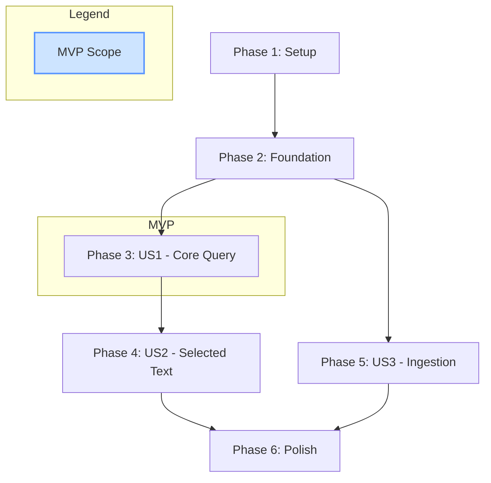

# Actionable Tasks: Free RAG Chatbot Backend

**Branch**: `005-rag-backend` | **Date**: 2025-12-09 | **Plan**: [plan.md](./plan.md)

This document breaks down the implementation of the RAG backend into specific, actionable tasks, ordered by dependency.

## Implementation Strategy

The feature will be built in phases, aligned with the user stories from the specification. This allows for incremental and independently testable development.

-   **MVP Scope**: The Minimum Viable Product will consist of completing **Phase 1, 2, and 3**. This will result in a functional API that can answer queries based on the book's content.
-   **Incremental Delivery**: Subsequent phases (US2, US3) can be developed and deployed independently.

## Phase 1: Project Setup

**Goal**: Create the complete directory structure and configuration files for the backend application.

-   [x] T001 Create the root `backend/` directory.
-   [x] T002 [P] Create subdirectories: `backend/rag/`, `backend/db/`, `backend/ingest/`, `backend/utils/`, `backend/tests/`.
-   [x] T003 [P] Create `backend/requirements.txt` and add all specified dependencies (FastAPI, Uvicorn, LangChain, etc.).
-   [x] T004 [P] Create `backend/.env.example` with placeholders for `GEMINI_API_KEY`, `QDRANT_URL`, `QDRANT_API_KEY`, and `NEON_DATABASE_URL`.
-   [x] T005 [P] Create a basic `backend/README.md` file with the project title.
-   [x] T006 [P] Create `__init__.py` files in all subdirectories (`rag`, `db`, `ingest`, `utils`, `tests`) to mark them as Python packages.

## Phase 2: Foundational Components

**Goal**: Implement the core, non-endpoint logic that is a prerequisite for all user stories.

-   [x] T007 Implement the embedding function in `backend/utils/embeddings.py` to handle calls to Gemini's embedding model.
-   [x] T008 Implement the singleton Qdrant client in `backend/rag/retriever.py`.
-   [x] T009 Implement the singleton Gemini LLM client in `backend/rag/generator.py`.
-   [x] T010 Define the `BookChunk` SQLAlchemy model in `backend/db/models.py`.

## Phase 3: User Story 1 - Core RAG Query

**Goal**: Implement the primary API endpoint for answering questions.  
**Independent Test**: The `/query` endpoint should return accurate answers based on ingested content.

-   [x] T011 [US1] Implement the core RAG chain logic in `backend/rag/pipeline.py`, which takes a question, gets an embedding, queries Qdrant, and passes context to the generator.
-   [x] T012 [US1] In `backend/app.py`, implement the `GET /health` endpoint.
-   [x] T013 [US1] In `backend/app.py`, implement the `POST /query` endpoint, calling the RAG pipeline.
-   [x] T014 [US1] Create `backend/tests/test_api.py` and write a test case for the `/query` endpoint, mocking the external API calls.

## Phase 4: User Story 2 - Selected Text Query

**Goal**: Enhance the `/query` endpoint to support contextual queries based on user-selected text.  
**Independent Test**: The `/query` endpoint, when given `selected_text`, should only use that text as context.

-   [x] T015 [US2] Modify `backend/rag/pipeline.py` to add a conditional path: if `selected_text` is provided, skip retrieval and use it as the context.
-   [x] T016 [US2] Update the `/query` endpoint in `backend/app.py` to handle the optional `selected_text` parameter.
-   [x] T017 [US2] Add a new test case to `backend/tests/test_api.py` to verify the `selected_text` functionality.

## Phase 5: User Story 3 - Content Ingestion

**Goal**: Create the mechanism for loading book content into the vector database.  
**Independent Test**: The `/ingest` endpoint should successfully load a document's content into Qdrant.

-   [x] T018 [US3] Implement the complete data ingestion logic in `backend/ingest/ingest_data.py` (loading, chunking, embedding, uploading).
-   [x] T019 [US3] In `backend/app.py`, implement the `POST /ingest` endpoint.
-   [x] T020 [US3] Create `backend/tests/test_ingestion.py` and write a test for the ingestion logic, mocking cloud service interactions.

## Phase 6: Polish & Documentation

**Goal**: Finalize documentation, add deployment configurations, and ensure code quality.

-   [x] T021 [P] Review all Python files and add bilingual (English/Urdu) comments and docstrings to every function.
-   [x] T022 [P] Thoroughly update and finalize the `backend/README.md` with detailed setup, usage, and deployment instructions.
-   [x] T023 [P] Create a `vercel.json` file in the root of the repository to configure the Vercel deployment for a FastAPI backend.

---

## Dependency Graph

-   **Phase 1** must be complete before all others.
-   **Phase 2** must be complete before Phases 3, 4, and 5.
-   **Phase 3** is the MVP.
-   **Phase 4** depends on Phase 3.
-   **Phase 5** is independent of Phases 3 and 4 and can be worked on in parallel.
-   **Phase 6** should be done last.

